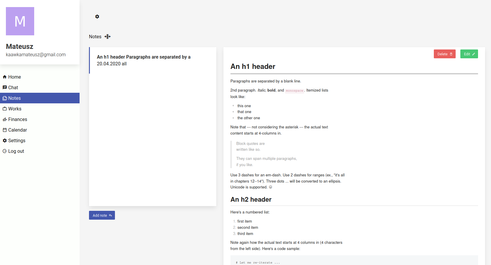

# freelance-application

## Tech
* VueJS + Vuex
* Firebase
* Buefy

## Roadmap

#### Modules:
* Notes - done
* Calendar - in development
* Chat - tba
* Finances -tba
* Works - tba 
* Settings -tba

## Preview


## Project setup
```
yarn install
```

### Compiles and hot-reloads for development
```
yarn serve
```

### Compiles and minifies for production
```
yarn build
```

### Customize configuration
See [Configuration Reference](https://cli.vuejs.org/config/).
